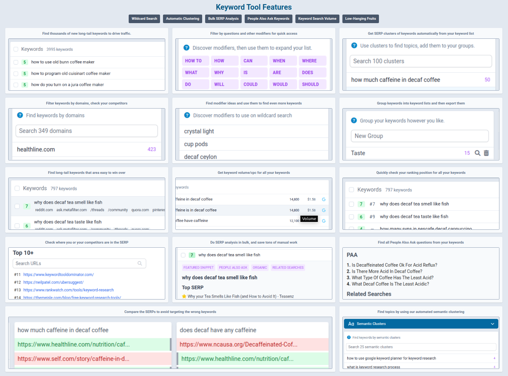

# Keyword Tool

The open source version of the original keyword tool code by SEO Ruler.

You can support further development on [Patreon](https://www.patreon.com/_pablodev)

Hacked together by [Pablo Rosales](http://github.com/pablorosales) on my free time.

## Requirements

For all features to work you'll need these APIs:

* DataForSEO API key (for SERP data)
* Keywords Everywhere API key (for keyword data)
* Open-AI API key (for GPT-3)

Not used yet but will be soon:

* Browserless API key (for future features on SERP Analysis)
* Huggingface API key (for future features)
* Google API key (for Google NLP API use)

## Features

Includes features like:

* Find low-hanging fruits (easy win score)
* Keyword Volume with Keywords Everywhere
* Keyword semantic clustering
* Keyword SERP clustering
* Bulk SERP Analysis
* Quick rankings check for all keywords
* Keyword Grouping (manual)
* Bulk PAA include
* Intent grouping
* Modifiers/Common terms, verbs and modifier ideas




## Env file (configuration)

Add a file on `app/.env.dev` with this (updated with your credentials):

```dotenv
SENTENCE_TRANSFORMERS_HOME=/tmp/.cache
MONGO_DB=seo-ruler
MONGO_URI=mongodb://mongo:27017
DEBUG=express:*
CHECKPOINT_DISABLE=1
GOOGLE_APPLICATION_CREDENTIALS=/home/node/creds.json
REDIS_URI=redis://redis:6379
REDIS_HOST=redis
REDIS_PORT=6379
CACHE_ENABLED=1
BODY_PARSER_LIMIT=100kb
COOKIE_DOMAIN=localhost
GOOGLE_USER_AGENT="Mozilla/5.0 (Windows NT 10.0; Win64; x64) AppleWebKit/537.36 (KHTML, like Gecko) Chrome/101.0.4951.67 Safari/537.36"

# Update this ones to the actual values inside the quotes, you need all for all features to work
SESSION_SECRET="<a random string>"
# Required APIs
D4S_API_USER="<your d4s api user>"
D4S_API_PASS="<your d4s api pass>"
KE_KEY="<your keywords everywhere key>"
BROWSERLESS_API="<your browserless api key>"
# For future features
GOOGLE_API_KEY="<your google api key>"
OPENAI_API_KEY="<your openai api key>"
HUGGINGFACE_API_KEY="<your huggingface api key>"
```

## Running the web app

* Install Docker (with Docker Compose)
* Run on the root of the project: `docker-compose up -d`
* Go to the browser and open `http://localhost:8080`

## To update to the latest version

* Do a git pull of the latest code
* Run `docker compose up -d --build` to rebuild
* Go to the browser and open `http://localhost:8080`

## Bug reports or feature requests

To report a bug or request a feature, please open an issue on [GitHub](https://github.com/PabloRosales/keyword-tool)

## License

See [LICENSE](LICENSE).
